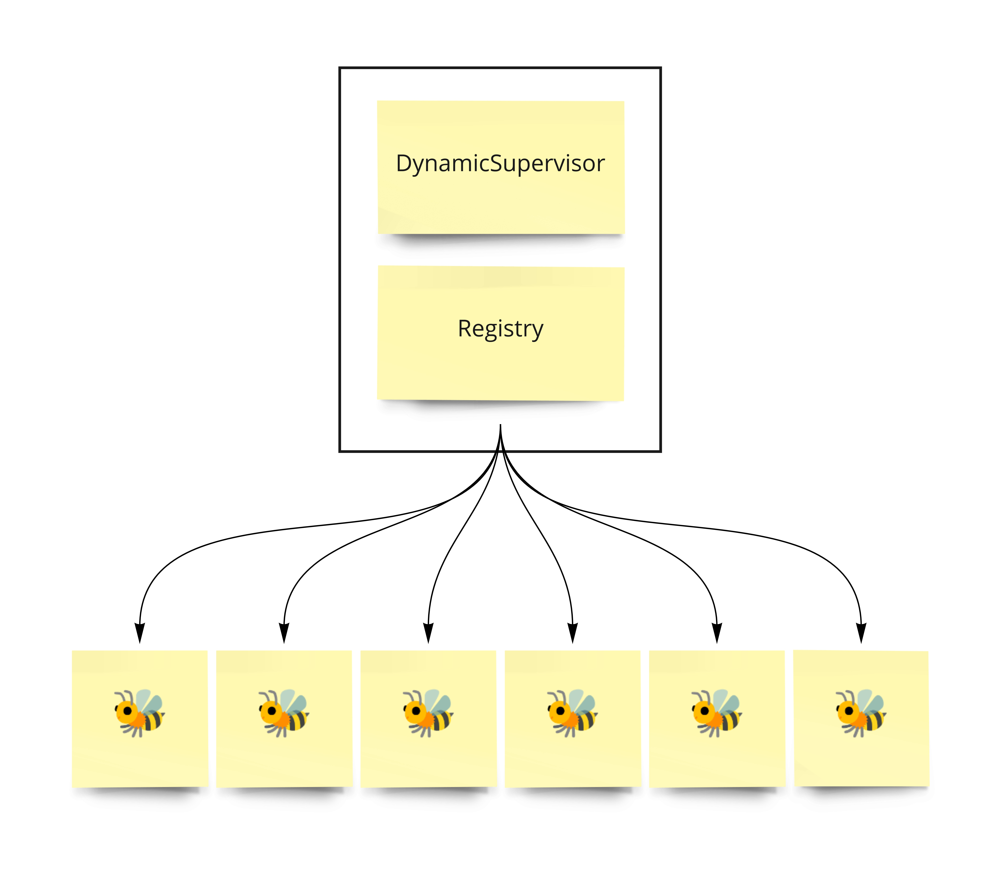
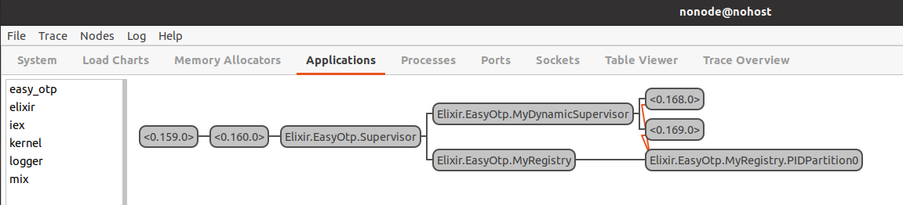

# EasyOtp

This library is just to be a real quick and easy example of how to dynamically supervise genservers and agents.

Copied the Agent and GenServer from the Elixir documentation circa 2022/05/24
